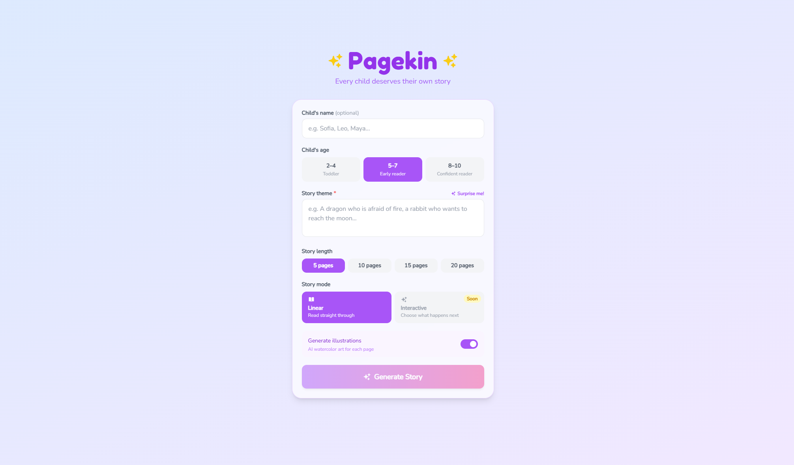
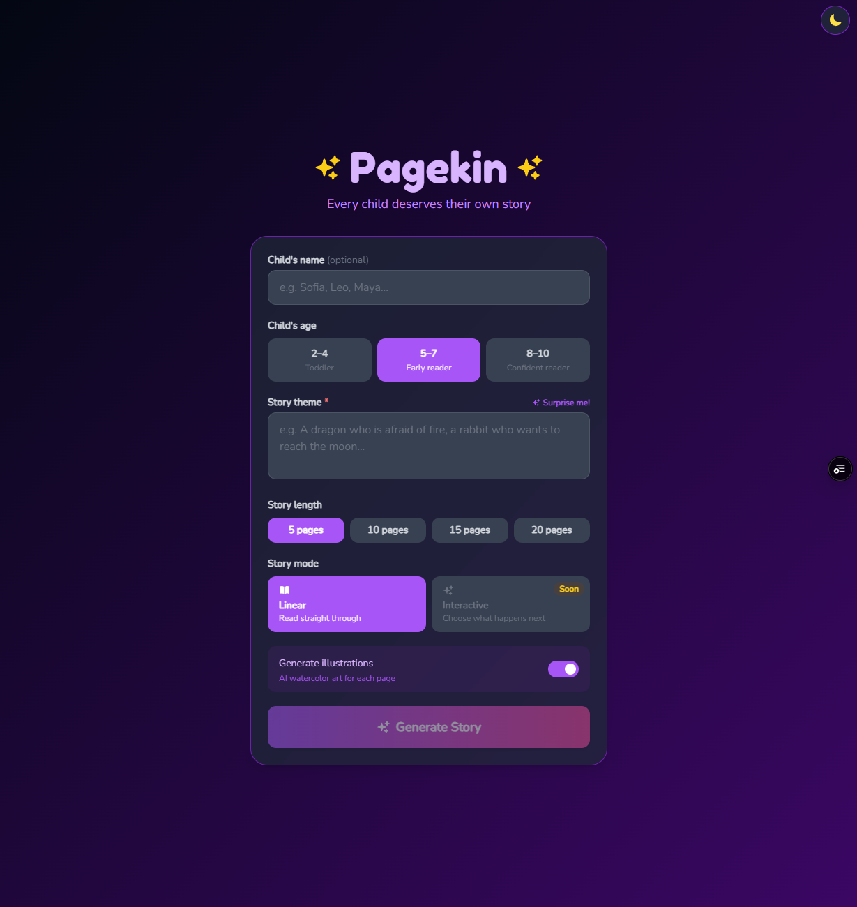

# 📖 Pagekin

> AI-powered personalized storybooks for children — generate, illustrate, narrate, and export in minutes.

**[Live Demo →](https://pagekin.vercel.app/)**

<table>
  <tr>
    <td></td>
    <td></td>
  </tr>
  <tr>
    <td align="center">Light mode</td>
    <td align="center">Dark mode</td>
  </tr>
</table>

---

## What It Does

Pagekin lets parents and children create personalized AI-generated storybooks. Enter a child's name, age, and a theme — or hit **Surprise me!** for an AI-suggested one — and Pagekin builds the story page by page, complete with watercolor-style illustrations, read-aloud narration, and a downloadable PDF keepsake.

| Feature | Detail |
|---|---|
| 🎨 **AI illustrations** | Watercolor-style art per page via HuggingFace FLUX.1-schnell |
| 📖 **Personalized stories** | Vocabulary and complexity adapt to the child's age range (2–4 / 5–7 / 8–10) |
| 🔊 **Read aloud** | Gemini TTS narrates each page; play a single page or the full story hands-free |
| 🎙️ **Voice recording** | Parents record their own narration per page — replaces AI voice on playback |
| 📄 **PDF export** | A5 format with cover page, illustrations, and page numbers via jsPDF |
| 💾 **Session persistence** | Up to 5 stories saved to localStorage; pick up where you left off |
| 🌙 **Dark mode** | System preference detection + manual toggle, persisted to localStorage |

---

## Tech Stack

| Layer | Technology |
|---|---|
| Frontend | React 19 + TypeScript (Vite) |
| Story generation | Gemini 3.1 Flash Lite Preview |
| Text-to-speech | Gemini 2.5 Flash TTS — voice: Kore |
| Illustrations | HuggingFace FLUX.1-schnell |
| PDF export | jsPDF (A5, client-side) |
| Hosting + API proxy | Vercel serverless functions |
| Analytics | Vercel Analytics |

---

## Technical Highlights

**Web Audio API for raw PCM playback** — Gemini TTS returns base64-encoded PCM audio. Rather than handing it to an `<audio>` tag, the app manually decodes it into an `AudioBuffer` and plays it through the Web Audio API. This gives precise control over start/stop, handles browser autoplay suspension via `AudioContext.resume()`, and avoids the format compatibility issues that come with `<audio>`.

**Server-side API proxy with key rotation** — All AI keys live exclusively in Vercel environment variables. Three-key rotation helpers (`_geminiWithRotation.js`, `_hfWithRotation.js`) cycle through keys on 429s with silent fallback, so quota exhaustion on one key degrades gracefully instead of crashing. Users can also supply their own Gemini key via an in-app banner to bypass server quota entirely.

**Per-page generation with background prefetch** — Pages are generated on demand as the reader advances. While the user reads page N, the app silently prefetches text and kicks off image generation for N+1 and N+2, making navigation feel instant without paying the upfront cost of generating a full story.

**Stale-closure-safe async loops** — `storyPagesRef` and `currentPageIndexRef` are kept in sync with state via `useEffect`. Long-running loops (play-all, record-all) read exclusively from refs so they always see the latest page data — no stale closures, no race conditions.

**Memory-safe voice recording** — Recordings use `URL.createObjectURL` for in-memory blob playback and call `URL.revokeObjectURL` on deletion or re-record to prevent memory leaks. Blob URLs are intentionally stripped from `localStorage` saves since they don't survive page reload.

---

## Getting Started

**Prerequisites:** Node.js 18+ and a free [Google Gemini API key](https://aistudio.google.com/app/apikey)

```bash
# 1. Clone the repo
git clone https://github.com/ManchDi/pagekin.git
cd pagekin

# 2. Install dependencies
npm install

# 3. Add your API keys
cp .env.example .env.local
# then fill in GEMINI_API_KEY (required) and HF_API_KEY (optional — disabling illustrations works without it)

# 4. Run locally
npm run dev
```

---

## Project Structure

```
pagekin/
├── api/                        # Vercel serverless functions (API proxy)
│   ├── _geminiWithRotation.js  # 3-key Gemini rotation helper
│   ├── _hfWithRotation.js      # 3-key HuggingFace rotation helper
│   ├── generate-image.js       # FLUX.1-schnell illustration generation
│   ├── generate-speech.js      # Gemini TTS → base64 PCM
│   ├── generate-story.js       # Per-page story generation
│   └── generate-theme.js       # "Surprise me!" theme suggestions
├── components/                 # React UI components
├── hooks/
│   └── useDarkMode.ts          # System preference + localStorage dark mode
├── services/
│   ├── geminiService.ts        # Proxy calls + QuotaError class
│   └── pdfService.ts           # jsPDF A5 export
├── App.tsx                     # All state, story logic, session management
└── types.ts                    # StoryConfig, StoryPage, SavedSession
```

---

## Roadmap

- [ ] **Multi-language** — story generation and TTS in Spanish, French, Russian, and more
- [ ] **Interactive mode** — choose-your-own-adventure branching with AI-generated choices after each page
- [ ] **Cloud saving** — user accounts with persistent story and recording storage
- [ ] **Art styles** — watercolor, cartoon, sketch, pixel art
- [ ] **Shareable links** — send a story to grandparents with one URL